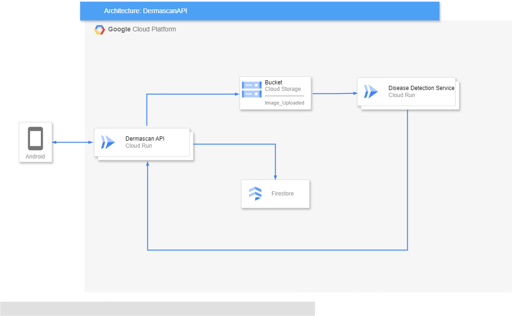

# DermaScan

DermaScan is a skin disease detection application, especially fungi. our team Inspired by the challenges of timely and accurate skin condition diagnosis, one of our team members envisioned an app that could empower individuals. Recognizing the potential to reduce confusion, anxiety, and potential delays in seeking appropriate care, their idea sparked our enthusiasm. We were drawn to the prospect of creating a user-friendly solution that could offer initial guidance and streamline the process of understanding and managing skin health concerns. This fueled our collaboration to build upon the concept,leveraging our diverse skillsets

# Current Features

This was the early features that this applications have.

1. Authentication

   
     

2. Browse for check the skin article

   
    
    
3. Get tour skin desease condition prediction

   
   
    
    

4. Get your result skin desease
   
    
   
   
5. Check your history Scan your skin

    
     
6. Check your profile name or want to change password
7. 
   

# Technical Details

## DermaScan Android Applications

The mobile application is made starting with UI/UX designs and a little UX research, then implementing the design results using native Kotlin Android by utilizing supporting libraries such as Retrofit to interact with APIs, ViewModel to maintain stable live data,and use datastore for save and get session user.

**Flow Android**

## DermaScan Cloud Computing Platform

**API Documentation :** (https://dermascan-be-ivdxzttfra-et.a.run.app/predict)

**Cloud Architecture**

**List Repostory for Cloud Computing**

#### 1. [Api-Design-Specification](www.google.com) (Filled with API design using OAS 3.0)

We implemented this the initial API design for our projects using OAS 3.0

#### 2. [skincheckai-api](https://github.com/Capstone-Project-C23-PR485/skincheckai-api) (main backend API)

Implemented using NestJS Framework and Prisma ORM.

#### 3. Machine learning backend

There is three machine learning backend used in this project. Each of them is for their own models. The backend is implemented using FastAPI.

- [Cloud-Acne-Detection-Service](https://github.com/Capstone-Project-C23-PR485/Cloud-Acne-Detection-Service)
- [Cloud-Wrinkle-Detection-Service](https://github.com/Capstone-Project-C23-PR485/Cloud-Wrinkle-Detection-Service)
- [Cloud-Flek-Detection-Service](https://github.com/Capstone-Project-C23-PR485/Cloud-Flek-Detection-Service)

We also create some simple UI to get firebase-auth token for development purposes, it was a forked project. This was the url : https://firebase-auth-ui-b6zefxgbfa-as.a.run.app/

## SkinCheck.AI Machine Learning Platform

This repository contains the implementation of three machine learning models for predicting
different skin conditions, namely acne type, wrinkle detection, and flake detection. We
employed transfer learning and fine-tuning techniques using the MobileNetV2 architecture in
the TensorFlow framework. The models were trained on a custom dataset that was specifically
curated for these tasks.

### Skin Condition Prediction Models

#### Acne Type Prediction

The acne type prediction model utilizes deep learning techniques to classify images of skin
into different acne types. By training on a diverse set of images, the model can accurately
classify acne types, such as hormonal acne, comedonal acne, inflammatory acne, and cystic
acne. This model can assist dermatologists and skincare professionals in diagnosing and
treating various forms of acne.

#### Wrinkle Detection

The wrinkle detection model is designed to identify and localize wrinkles in facial images. By
leveraging the power of deep learning, this model can detect different types of wrinkles, such
as fine lines, crow's feet, and forehead wrinkles. It provides a useful tool for evaluating the
effectiveness of anti-aging treatments and skincare regimens.

#### Fleck Detection

The flake detection model aims to detect and analyze flaky skin conditions, such as dryness
and dandruff. By examining images of the skin surface, this model can identify areas with
flaking and provide insights into the severity of the condition. This information can aid skincare
professionals in recommending appropriate treatments and moisturizers for individuals with
flaky skin.

### Skincare Recommendation System

In addition to the skin condition prediction models, we have also developed a skincare
recommendation system. We created and preprocessed a comprehensive skincare product
dataset, which includes information about various skincare products. The dataset contains
details such as the brand, type of skincare, ingredients, suitability for different skin types, a
link to buy the product, and ratings.

Our skincare recommendation system leverages this dataset to generate personalized
skincare recommendations based on an individual's specific skin needs. By considering
factors such as skin type, concerns, and ingredient preferences, the system suggests suitable
skincare products that align with the user's requirements. This can simplify the process of
finding and selecting effective skincare products tailored to individual needs.

# Getting Started

### Mobile Development

To get started with the mobile development, you can start by installing Android Studio. Then cloning this [repository](https://github.com/Dermascan-C241-PS084/DermaScan-MD) to your local machine.

### Cloud Computing

To get started to deploy the server, you need a way to deploy the applications. We defaulted to use Google Cloud Platform to deploy our server. We utilize Cloud Run, Cloud Build, Google Cloud Storage, Google Cloud SQL, Google Cloud Pub/Sub, and Firebase Authentication. The step to use is below:

Cloud Computing

To begin deploying your server, you need a method to deploy the application. We've opted to use Google Cloud Platform for our server deployments, utilizing Cloud Run, Cloud Build, Google Cloud Storage, and Firestore. Here are the steps to follow:

1. Create a GCP Project
2. Create a Firestore Instance
3. Create a Cloud Storage Bucket
4. Clone, Build, and Deploy the Code from the Repository to Cloud Run: https://github.com/Dermascan-C241-PS084/DermaScan-CC.git
5. Clone, Build, and Deploy the Machine-Learning Backend to Cloud Run: https://github.com/Dermascan-C241-PS084/DermaScan-ML.git
6. Update All Environment Variables in the Cloud Run Service

####

### Machine Learning

To get started with the skin condition prediction models and skincare recommendation system, please follow the instructions below:

1. Clone The Repository https://github.com/Dermascan-C241-PS084/DermaScan-ML.git
2. Install the necessary Python packages specified in the requirements.txt file with the following command:
pip install -r requirements.txt 
3. Explore the Jupyter notebooks and ReadMe  : 
Explore the provided Jupyter notebooks and the README file to understand how to use the models effectively. The notebooks will guide you through different functionalities and how to utilize the model for skin lesion analysis.
4. If you want test our model, you can go to “Test with New Image” section .
To test the model with a new image:
   - Navigate to the "Test with New Image" section in one of the Jupyter notebooks.
   - Run the code cell to upload your image. This cell will allow you to choose an image file from your local machine.
   - After uploading the image, run the remaining code cells in the "Test with a New Image" section. This will involve loading the model, processing the image, making a prediction, and displaying the results.

## Project Overview

This project is focused on building and training a deep learning model to classify images of common skin disease. The project utilizes a dataset available on Kaggle, which consists of images of 8 types of common skin disease.

## Dataset

The dataset used in this project is the [Skin-Disease-Dataset](https://www.kaggle.com/datasets/subirbiswas19/skin-disease-dataset) available on Kaggle. It includes a good amount of images (around 1,100). In this dataset there are total 8 class ,They are:

1. Bacterial Infections - cellulitis
2. Bacterial Infections - impetigo
3. Fungal Infections - athlete -foot
4. Fungal Infections - nail-fungus
5. Fungal Infections - ringworm
6. Parasitic Infections - cutaneous-larva-migrans
7. Viral skin infections - chickenpox
8. Viral skin infections - shingles.

## Data Preparation
The dataset is downloaded using kaggle API, extracted, and divided into training validation and test sets

## Model Architecture
The model is a convolutional neural network (CNN) using transfer learning method with MobileNetV2.

## Training the Model
The model is trained using callbacks like EarlyStopping, and TensorBoard to optimize performance and prevent overfitting.

## Evaluation and Visualization
The model's performance is evaluated and visualized using Plotly. Graphs for loss and accuracy are plotted to understand the training and validation metrics over epochs.

## Accuracy

- The Train accuracy of this model is **98.65%**
- The Validation accuracy of this model is **96.17%**
- The Test accuracy of this model is **97.00%**

## Training graphs

## Tensorboard
TensorBoard logs, useful for detailed performance analysis, available under the **logs** folder.
